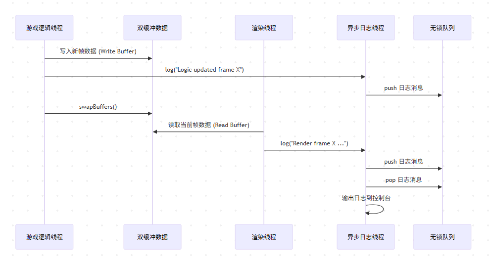

# Shadow_engine
Shadow_engine 是一个使用 C++ 编写的多线程游戏引擎 Demo，展示了无锁队列、异步日志系统和双缓冲数据交换的实现。 
项目包含：  无锁队列：基于环形缓冲区的单生产者单消费者队列，避免锁竞争。 
异步日志系统：独立日志线程，非阻塞记录运行信息。 双缓冲数据交换：逻辑与渲染线程安全交换游戏状态数据。 
多线程架构：模拟游戏逻辑与渲染的并行执行。 适合学习高性能 C++ 多线程编程与游戏引擎基础架构。



# Shadow_engine

Shadow_engine 是一个 C++ 多线程游戏 Demo，加入无锁队列、异步日志系统和双缓冲数据交换的实现。

## 特性
- 无锁队列（单生产者单消费者）
- 异步日志系统
- 双缓冲数据交换
- 多线程架构模拟游戏逻辑与渲染

## 构建与运行
```bash
mkdir build && cd build
cmake ..
make
./shadow_engine
---

```
执行后
[LOG] Logic updated frame 0
[LOG] Render frame 0 Entities: 0
[LOG] Logic updated frame 1
[LOG] Render frame 1 Entities: 3
[LOG] Logic updated frame 2
[LOG] Render frame 2 Entities: 3
[LOG] Logic updated frame 3
[LOG] Render frame 2 Entities: 3
[LOG] Render frame 3 Entities: 3
[LOG] Logic updated frame 5
[LOG] Render frame 4 Entities: 3
[LOG] Logic updated frame 6
[LOG] Render frame 5 Entities: 3
[LOG] Render frame 6 Entities: 3
[LOG] Render frame 7 Entities: 3
[LOG] Logic updated frame 9
[LOG] Render frame 9 Entities: 3
[LOG] Logic updated frame 10
[LOG] Logic updated frame 11
[LOG] Render frame 10 Entities: 3
[LOG] Logic updated frame 12
[LOG] Logic updated frame 13
[LOG] Render frame 12 Entities: 3
[LOG] Logic updated frame 14
[LOG] Render frame 14 Entities: 3
[LOG] Render frame 15 Entities: 3
[LOG] Logic updated frame 17
[LOG] Logic updated frame 18
[LOG] Render frame 17 Entities: 3
[LOG] Render frame 18 Entities: 3
[LOG] Render frame 19 Entities: 3
[LOG] Logic updated frame 20
[LOG] Render frame 20 Entities: 3
[LOG] Render frame 21 Entities: 3
[LOG] Logic updated frame 23
[LOG] Logic updated frame 24
[LOG] Render frame 23 Entities: 3
[LOG] Render frame 24 Entities: 3
[LOG] Logic updated frame 26
[LOG] Render frame 26 Entities: 3
[LOG] Logic updated frame 27
[LOG] Logic updated frame 28
[LOG] Logic updated frame 29
[LOG] Render frame 28 Entities: 3
[LOG] Logic updated frame 30
[LOG] Render frame 30 Entities: 3
[LOG] Logic updated frame 31
[LOG] Logic updated frame 32
[LOG] Render frame 31 Entities: 3
[LOG] Logic updated frame 33
[LOG] Render frame 33 Entities: 3
[LOG] Logic updated frame 34
[LOG] Render frame 34 Entities: 3
[LOG] Logic updated frame 35
[LOG] Logic updated frame 36
[LOG] Render frame 35 Entities: 3
[LOG] Render frame 36 Entities: 3
[LOG] Logic updated frame 38
[LOG] Logic updated frame 39
[LOG] Render frame 38 Entities: 3
```